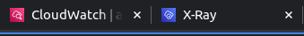

# aws-favicon-fixer

This Chrome extension changes the tab icon and title.
- "CloudWatch" (with X-Ray pages) into "X-Ray".

Note: On some occasions, the tab icon and title might not update instantly due to loading sequences. Reloading the tab should apply the changes correctly.

# How to install
- Download the folder of this extension.
- Go to chrome://extensions/, turn on Developer mode.
- Click Load unpacked
- Find and select the folder
- See https://support.google.com/chrome/a/answer/2714278?hl=en

# TODO
- Apply to other aws services
